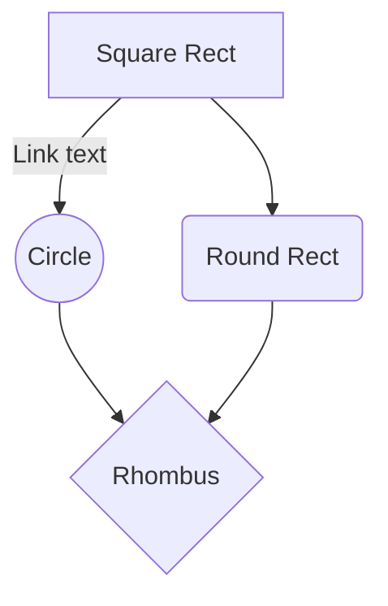

# N-Tangled
Build a word game to entertain the American Heritage faculty and students

## N-Gram portion
**Task:** Identify word colocations using Google Ngram or local datasets.

**Responsibilities:** 
* Write scripts to pull and filter Ngram data.
* Identify high-frequency bigrams
* * Suffix (e.g., "silver" -> "lining," "spoons," "bullet", "mine")
* * Prefix (e.g., "oil" -> "baby", "olive", "motor", "avocado")
* Create a JSON where a single word anchors one or more sets of four distinct words.
* * {"prefix": {"silver":[["lining," "spoons," "bullet", "mine"], [...]], "hot": {...}},
* *  "suffix": {"oil":[["baby," "olive," "motor", "avocado"], [...]], "hot": {...}} }

**Deliverable:** 
A JSON utility that returns a list of words sharing a common bigram prefix and a list of words sharing a common bigram suffix.

## WordNet portion
**Task:** Identify polysemous words (words with many "synsets").

**Responsibilities:** 
* Use WordNet to find words with high "sense counts" (e.g., "Crane" as a bird vs. "Crane" as machinery).
* Filter for nouns and verbs to ensure the words are interchangeable in a grid.
* Map synonyms to help Team 3 find category members.

**Deliverable:** A function get_ambiguous_senses(word) that outputs distinct semantic paths for a given term.

## Create four word sets
**Task:** The "Connectors." They build the actual sets of four.

**Responsibilities:** 
* Consume data from Teams 1 and 2 to create "Valid Sets."
* Ensure each set has a "Category Name" (e.g., "Parts of a Shoe" or "___ Cake").
* Create a logic check to ensure that within a single set of four, the connection is robust.

**Deliverable:** A Category class that stores a label and four string items.

## Distraction Logic
**Task:** This is the most "human" part of the AI. They must find words that could belong to two categories.

**Responsibilities:** 
* Analyze the output of Team 3 and look for "Cross-Pollination."
* If Team 3 has a "Fruit" category and a "Tech Companies" category, this team suggests "Apple" as a mandatory inclusion to confuse the player.
* Calculate "Distraction Scores" for a 16-word grid.

**Deliverable:** A script that swaps one word from a category with a semantically ambiguous "traitor" word from the database.

## Game Engine
**Responsibilities:** 
* Handle the selection logic (the "Check" button).
* Track the "lives" (four mistakes and you're out).
* Implement the shuffle logic and ensure the 16 words are randomized across the 4x4 grid.

**Deliverable:** A GameSession class that manages the is_correct() logic and state transitions.

## DevOps and UI
Task: Manage the GitHub repo and the user's view.
Responsibilities: * Set up the GitHub Actions for testing.
Build a simple CLI (Command Line Interface) or a Streamlit/Flask web app so people can actually play.
Manage the README.md and the requirements.txt.
Deliverable: The main entry point of the program (main.py) and the visual board layout.

|SPOON| BABY | HAIKU | FIREFLY|
|--|--|--|--|
| BULLET | SONNET | STAR TREK| OLIVE|
|SPACE 1999|ODE|MOTOR|MINE|
| DOLLAR | RED DWARF | AVOCADO | LIMERICK |

And this will produce a flow chart:

